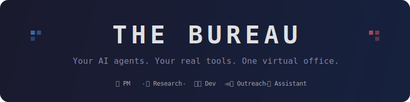

<p align="center">
  
</p>

<p align="center">
  <strong>A virtual AI agent office where your digital team does your real work.</strong><br>
  Walk around a pixel-art office, talk to your AI employees, call meetings, assign tasks — they use your real tools.
</p>

<p align="center">
  <a href="#quick-start">Quick Start</a> &bull;
  <a href="#features">Features</a> &bull;
  <a href="#the-team">The Team</a> &bull;
  <a href="#supported-llm-providers">LLM Providers</a> &bull;
  <a href="#customizing-agents">Customizing</a> &bull;
  <a href="#architecture">Architecture</a>
</p>

---

## What is this?

The Bureau is a **multi-agent AI office** that looks like a retro pixel-art game but runs real work behind the scenes. Each character is an autonomous AI agent with persistent memory, specialized tools, and the ability to collaborate with teammates.

You are the boss. You walk around, click characters to chat, call team meetings, and review deliverables. The agents handle research, project management, outreach, development, and note-taking — connected to Jira, email, Zoom, GitHub, HuggingFace, web scraping, and more.

**Bring your own LLM** — works with Anthropic Claude, OpenAI GPT, Xiaomi MiMo, OpenRouter, NVIDIA Nemotron, or any compatible API. Pick your provider and paste your key in the Settings panel. No server restart needed.

### Key highlights

- **5 AI agents** with distinct roles, tools, and personalities
- **Real tool integrations** — Jira tickets, email drafts, web scraping, GitHub repos, HuggingFace models, Zoom recordings, Spotify
- **Team meetings** with live mic recording, speech-to-text transcription, speaker diarization, and auto-generated meeting notes
- **Knowledge base** — upload PDFs, Word docs, spreadsheets; agents read and reference them
- **Persistent memory** — agents remember past conversations and learn from corrections
- **Agent collaboration** — agents consult each other via internal team messages
- **Deliverable inbox** — agents submit work products for your review (approve/reject)
- **Real document creation** — agents produce .docx, .xlsx, .pptx files you can download
- **Break room** — agents have casual AI-powered conversations (via Groq, near-free)
- **Fully customizable** — add/remove agents, edit prompts, change sprites, connect new tools

---

## Quick Start

### Prerequisites

| Requirement | Version | Notes |
|---|---|---|
| **Node.js** | 20+ | Tested on 22 and 24 |
| **npm** | 9+ | Comes with Node.js |
| **ffmpeg** | any | On PATH. For meeting transcription. [Download](https://ffmpeg.org/download.html) |
| **LLM API Key** | — | Anthropic, OpenAI, OpenRouter, MiMo, Nemotron, or any compatible |

### Install & run

```bash
git clone https://github.com/YahyaaZeeshan/the-bureau.git
cd the-bureau
npm install
cp .env.example .env      # edit for optional integrations (Jira, email, Zoom, etc.)
npm run dev                # starts server (:4317) + web (:5180)
```

Open **http://localhost:5180** in your browser.

### Configure your LLM

1. Click the **gear icon** (top-right)
2. Select your **Provider** from the dropdown
3. Paste your **API Key**
4. Base URL and Model auto-fill (editable)
5. Done — agents are ready immediately

```
┌─────────────────────────────────────────────┐
│  ⚙ Office Settings                         │
│                                             │
│  LLM PROVIDER                              │
│  ┌─────────────────────────────────────┐    │
│  │ Provider:  [Anthropic Claude    ▾]  │    │
│  │ API Key:   [sk-•••••••••••••••••]   │    │
│  │ Base URL:  (auto-filled)            │    │
│  │ Model:     claude-sonnet-4-20250514 │    │
│  └─────────────────────────────────────┘    │
│                                             │
│  CHATTER / FALLBACK (GROQ)                  │
│  Groq API Key: [gsk_•••••••]  (free)       │
│  ☑ Groq fallback  ☐ Lively break room      │
│                                             │
│  BEHAVIOR                                   │
│  ☐ Auto-approve sensitive actions           │
└─────────────────────────────────────────────┘
```

---

## Features

### Talk to your agents
Click any character to open a chat. Ask them to do real work — create Jira tickets, research competitors, draft emails, build demos, organize your knowledge base. They use their tools, show you the results, and ask for approval before taking action.

### Team meetings
Click **Meeting**, pick attendees, and everyone walks to the conference room. Use `@Name` to direct questions. Hit the **Record** button to capture audio — the system transcribes it with speaker diarization and generates structured meeting notes automatically.

### Knowledge base
Upload PDFs, Word docs, spreadsheets, and presentations. All agents can search and reference them. Agents can also create and update KB documents. Your docs stay local — never sent to third parties.

### Deliverable inbox
When agents produce substantial work (reports, research briefs, grant strategies), they submit it to your **Inbox**. Review, approve, or reject with feedback. Approved work is saved to the knowledge base.

### Break room
Send agents on break — they walk to the lounge and have autonomous AI-powered conversations about industry trends, share knowledge, and build team dynamics. Powered by Groq (free tier).

### Approval model
**Reading is free; acting needs you.** Creating Jira issues, sending emails, writing KB docs, running shell commands — all pop an approval toast. You see exactly what the agent wants to do before it happens. Toggle auto-approve in Settings if you trust them fully.

---

## The Team

| | Character | Role | Connected to | What they do |
|---|---|---|---|---|
| 📋 | **Priya** | Project Manager | Jira, docs, web | Sprint planning, status updates, create/edit tickets, coordinate team |
| 🔎 | **Marco** | Research Analyst | Web scraping, GitHub, docs | Market research, competitor analysis, technical surveys |
| 🛠️ | **Dex** | Developer | HuggingFace, GitHub, shell, docs | Feasibility checks, prototype demos, model scouting |
| ✉️ | **Grace** | Outreach & Comms | Web scraping, email, docs | Find contacts, draft personalized emails |
| 🎧 | **Zola** | Personal Assistant | Zoom, Spotify, docs | Knowledge base, meeting notes, todos, office DJ |
| 🧑 | **You** | The Boss | — | Click the floor to walk, click characters to interact |

All agents share:
- **Persistent memory** — they learn from corrections and remember context across sessions
- **Knowledge base access** — upload docs once, everyone can reference them
- **Team chat** — agents consult each other when their specialty is needed
- **Playbooks** — editable markdown files that define each agent's rules and skills
- **Document creation** — Word (.docx), Excel (.xlsx), PowerPoint (.pptx)

---

## Supported LLM Providers

| Provider | Default Model | Notes |
|---|---|---|
| **Anthropic Claude** | claude-sonnet-4-20250514 | Direct API — best tool-use support |
| **OpenAI GPT** | gpt-4o | Via Anthropic SDK compatibility |
| **Xiaomi MiMo** | mimo-v2.5-pro | Anthropic-compatible proxy |
| **OpenRouter** | anthropic/claude-sonnet-4 | Multi-model gateway, 200+ models |
| **NVIDIA Nemotron** | llama-3.1-nemotron-70b | Free tier at [build.nvidia.com](https://build.nvidia.com) |
| **Custom** | (you provide) | Any Anthropic-compatible endpoint |

Switching providers takes effect instantly — no restart needed. The Base URL and Model auto-fill when you pick a provider but are fully editable.

---

## Optional Integrations

All integrations are optional. Missing credentials don't break anything — the agent tells you what's not connected.

Configure in `.env` or in the Settings UI:

| Integration | Env Vars | Used by | Get credentials |
|---|---|---|---|
| **Jira** | `JIRA_BASE_URL`, `JIRA_EMAIL`, `JIRA_API_TOKEN` | Priya | [Atlassian API tokens](https://id.atlassian.com/manage-profile/security/api-tokens) |
| **Email (SMTP)** | `SMTP_HOST`, `SMTP_PORT`, `SMTP_USER`, `SMTP_PASS` | Grace | Gmail: use [App Passwords](https://myaccount.google.com/apppasswords) |
| **Zoom** | `ZOOM_ACCOUNT_ID`, `ZOOM_CLIENT_ID`, `ZOOM_CLIENT_SECRET` | Zola | [Zoom Server-to-Server OAuth](https://marketplace.zoom.us/docs/guides/build/server-to-server-oauth-app/) |
| **Groq** | `GROQ_API_KEY` | Break-room chatter, LLM fallback | Free at [console.groq.com](https://console.groq.com/keys) |
| **Spotify** | `SPOTIFY_CLIENT_ID`, `SPOTIFY_CLIENT_SECRET` | Zola (DJ) | [Spotify Developer Dashboard](https://developer.spotify.com/dashboard) |
| **HuggingFace** | `HF_TOKEN` | Dex (model search) | [HF Tokens](https://huggingface.co/settings/tokens) |
| **GitHub** | `GITHUB_TOKEN` | Dex, Marco | [GitHub PAT](https://github.com/settings/tokens) |

---

## Customizing Agents

### Add / edit / remove in the UI

- **Team tab** → click any agent → edit name, title, prompt, sprite, toolsets
- **+ Add employee** → create a new agent from scratch
- **Fire** → remove an agent (with confirmation)

Changes take effect immediately — no restart.

### Agent playbooks

Drop markdown files in `data/agent-docs/` to give agents persistent instructions:

```
data/agent-docs/
  _common.md       ← rules all agents share (team rules, approval policy)
  _project.md      ← your company/project context (all agents see this)
  pm.md            ← Priya's specific playbook
  researcher.md    ← Marco's specific playbook
  builder.md       ← Dex's specific playbook
  outreach.md      ← Grace's specific playbook
  notetaker.md     ← Zola's specific playbook
```

Default templates ship in `data/agent-docs-default/` and are auto-copied on first boot. Edit the copies in `data/agent-docs/` — they're gitignored so your customizations stay private.

Agents can also update their own playbooks via the `update_playbook` tool — lessons learned become permanent skills.

### Available toolset tags

| Tag | What it enables |
|---|---|
| `jira` | Create, edit, transition, search Jira issues |
| `docs` | Read/write knowledge base, create Word/Excel/PPT files |
| `web` | Web search + web fetch |
| `scrape` | Deep web scraping with content extraction |
| `email` | Send emails via SMTP |
| `hf` | Search HuggingFace models/spaces/papers |
| `github` | Search GitHub repos, read READMEs |
| `bash` | Run shell commands (approval-gated) |
| `zoom` | Fetch Zoom recordings + transcripts |
| `spotify` | Control Spotify playback (needs Premium) |
| `reach` | Agent-Reach: Jina + YouTube tools |

---

## Data Layout

```
the-bureau/
├── data/
│   ├── agent-docs/           agent playbooks (your edits, gitignored)
│   ├── agent-docs-default/   default playbook templates (ships with repo)
│   ├── personas.json         agent configs (auto-created from defaults)
│   ├── personas.default.json starter agent definitions
│   ├── settings.json         LLM provider + office settings (gitignored)
│   ├── memory/               per-agent persistent memory
│   ├── logs/                 per-agent JSONL activity logs
│   ├── drafts/               email/document drafts
│   ├── workspaces/           per-agent scratch directories
│   └── deliverables/         work products awaiting review
├── knowledge-base/           shared docs (upload via UI, gitignored)
├── server/                   Express + WebSocket backend
├── web/                      React + Vite frontend
├── .env.example              env template (copy to .env)
└── .env                      your credentials (gitignored)
```

---

## Architecture

```
┌──────────────────────────────────────────────────────────┐
│                    Browser (React + Vite)                 │
│  ┌─────────┐  ┌──────────┐  ┌────────┐  ┌───────────┐  │
│  │ Canvas  │  │  Chat UI │  │ Panel  │  │ Settings  │  │
│  │ Engine  │  │  + Dock  │  │ Tabs   │  │  Modal    │  │
│  └────┬────┘  └────┬─────┘  └───┬────┘  └─────┬─────┘  │
│       └─────────────┴────────────┴─────────────┘        │
│                         WebSocket                        │
└─────────────────────────┬────────────────────────────────┘
                          │
┌─────────────────────────┴────────────────────────────────┐
│                 Server (Express + tsx)                    │
│                                                          │
│  ┌──────────┐  ┌────────────┐  ┌──────────────────────┐ │
│  │ Agent    │  │ LLM Client │  │   Tool Router        │ │
│  │ Runtime  │──│ (Anthropic │──│  Jira │ Email │ Web  │ │
│  │          │  │  SDK)      │  │  Docs │ HF    │ Git  │ │
│  └──────────┘  └────────────┘  └──────────────────────┘ │
│                                                          │
│  ┌──────────┐  ┌────────────┐  ┌──────────────────────┐ │
│  │ Meeting  │  │  Sherpa    │  │  Knowledge Base      │ │
│  │ Engine   │──│  STT +     │  │  + Embeddings        │ │
│  │          │  │  Diarize   │  │                      │ │
│  └──────────┘  └────────────┘  └──────────────────────┘ │
└──────────────────────────────────────────────────────────┘
```

### Tech stack

| Layer | Technology |
|---|---|
| Frontend | React 18, Vite, TypeScript, HTML5 Canvas |
| Backend | Node.js, Express, WebSocket (ws), tsx |
| LLM | Anthropic SDK (with baseURL override for any provider) |
| Speech | sherpa-onnx (local STT + speaker diarization) |
| Chatter | Groq (Llama 3.3 70B) |
| Documents | docx / exceljs / pptxgenjs |

---

## Windows Quick Launch

Double-click **`Open Pixel Office.bat`** — it starts the server (if not already running) and opens the browser. When you close the browser tab, the server auto-shuts down after ~45 seconds.

For manual control:
- `Start Office.bat` — starts with a visible terminal window
- `Stop Office.bat` — force-stops everything

---

## FAQ

**Q: Which LLM provider should I use?**
Anthropic Claude has the best tool-use support. MiMo is fast and cheap. OpenRouter gives you access to 200+ models. Start with whatever API key you already have.

**Q: Do I need all the integrations?**
No. The office works with just an LLM key. Integrations add superpowers (Jira, email, etc.) but are all optional.

**Q: Where is my data stored?**
Everything stays local in the project directory. Documents, memory, settings, logs — all on your machine. The only external calls are to your chosen LLM provider and any integrations you configure.

**Q: Can I add my own agents?**
Yes. Click **+ Add employee** in the Team tab, or POST to `/api/personas`. Give them a name, role, prompt, and toolsets.

**Q: Can I use this with my own MCP servers?**
The agent system supports MCP bridge configuration. Add your MCP server details to the agent's toolset config.

**Q: How does meeting transcription work?**
Click Record during a meeting → audio is captured from your mic → processed locally via sherpa-onnx (no cloud STT) → transcribed with speaker diarization → Zola generates structured meeting notes.

---

## Contributing

PRs welcome. The codebase is TypeScript end-to-end. Run `npm run dev` for hot-reload development.

Key files to know:
- `server/src/agents.ts` — agent runtime and session management
- `server/src/mimoAgent.ts` — LLM client loop (Anthropic SDK)
- `server/src/mimoTools.ts` — tool definitions
- `server/src/settings.ts` — multi-provider config
- `web/src/ui/Dock.tsx` — main UI panel (chat, meeting, KB, etc.)
- `web/src/game/engine.ts` — pixel-art game engine

---

## License

MIT. See [LICENSE](LICENSE).

Character sprites by [JIK-A-4 Metro City pack](https://jik-a-4.itch.io/metrocity-free-topdown-character-pack).
